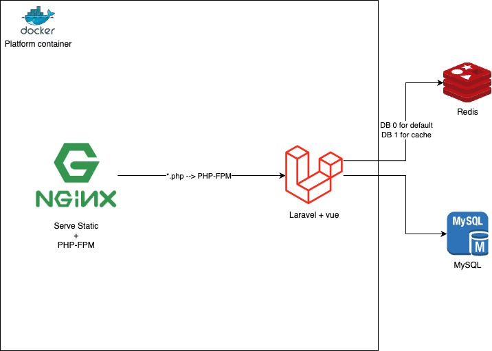

# How to Run

```
docker compose up
```
- Web: http://localhost:5000
- PhpMyAdmin: http://localhost:5001
- PhpMyAdmin password same as MYSQL_PASSWORD in [docker-compose.yml](./docker-compose.yml)

## Demo db
- file: [database/empty-with-admin-user.sql](./database/empty-with-admin-user.sql)
- email: admin@admin.com
- password: admin

## Conainer Connection diagram
